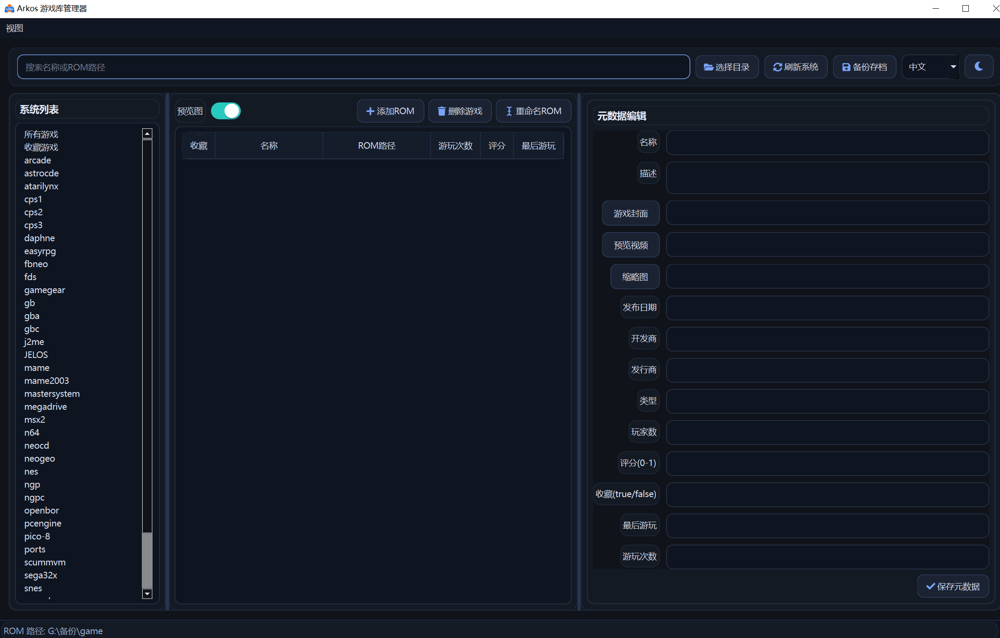
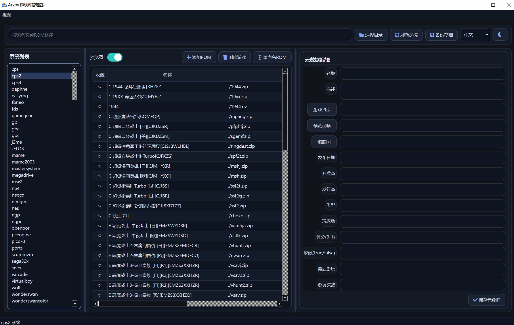
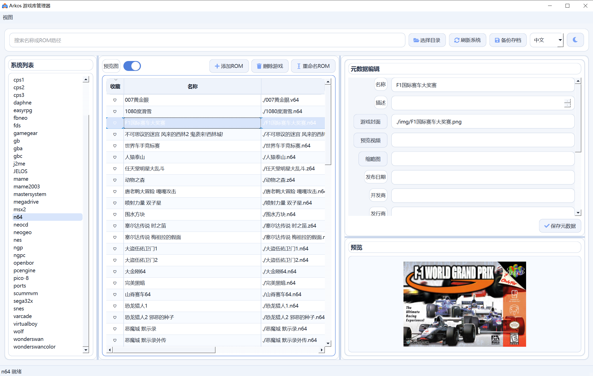

# ArkosGameMan
# 请注意！这是完全由AI生成并发布的应用程序！

ArkosGameMan 是一个基于 PySide6 的 ArkOS 游戏库管理工具，用于管理游戏与 `gamelist.xml` 元数据。

## 功能概览

- 系统扫描与切换：自动识别系统目录并展示游戏列表
- 多视图模式：支持单系统、所有游戏、收藏游戏视图
- 元数据管理：编辑 `name/desc/image/video/thumbnail/rating/favorite` 等字段
- 媒体导入：支持导入封面、缩略图、预览视频并写入相对路径
- ROM 管理：添加、删除、重命名 ROM，并可联动处理关联资源
- 收藏与分组：收藏列快捷切换，收藏视图按系统分组显示
- 预览能力：图片预览、视频预览、图片双击放大查看
- 主题与语言：亮暗主题切换，中英日俄多语言界面
- 列宽调节：游戏列表支持像 Excel 一样拖动表头调整列宽
- 自动更新：后台检测 GitHub Release 新版本并支持一键下载更新
- 日志输出：关键流程输出 INFO/ERROR 日志，便于排障




## 技术栈

- Python 3.10+
- PySide6
- QtAwesome

## 目录结构

```text
ArkosGameMan/
├─ app.py                # 程序入口与日志初始化
├─ qt_controller.py      # 控制器层（事件编排）
├─ qt_view.py            # 视图层（Qt UI）
├─ arkos_core.py         # 模型/服务层（ROM与元数据逻辑）
├─ updater.py            # 更新检查与下载安装逻辑
├─ version.py            # 版本号
├─ i18n.py               # 多语言资源
├─ styles/
│  ├─ dark.qss
│  └─ light.qss
└─ arkosgameman.ini      # 本地配置（上次ROM根目录）
```

## 安装与运行

### 1) 安装依赖

```bash
pip install PySide6 qtawesome
```

### 2) 启动程序

```bash
python app.py
```

## 数据与配置说明

- ROM 根目录由界面选择，并保存到 `arkosgameman.ini`
- 每个系统目录下使用 `gamelist.xml` 保存元数据
- 保存时会生成 `gamelist.xml.old` 作为备份
- 可在 `arkosgameman.ini` 中配置更新检查：
  - `[update]`
  - `repository = 你的GitHub用户名/仓库名`
  - `check_on_start = true`
- 媒体相对路径示例：
  - `./media/covers/xxx.png`
  - `./media/thumbnails/xxx.png`
  - `./media/videos/xxx.mp4`

## 关键设计说明

- 采用 MVC 分层：
  - `qt_view.py` 仅负责界面与信号发射
  - `qt_controller.py` 负责业务流程和状态协调
  - `arkos_core.py` 负责文件系统与 XML 数据读写
- 所有单系统写操作（保存元数据、删除、重命名）均在目标系统作用域内执行，避免跨系统写入。

## 常见问题

### Q1: 为什么在“收藏游戏”里删除会影响其他系统？

历史缺陷原因是：收藏/全库模式会聚合多系统游戏，若直接拿聚合列表回写某一系统的 `gamelist.xml`，会造成串写。当前版本已修复为“写入前先加载目标系统游戏，再按 path 精确更新/删除”。

### Q2: 搜索时报 `TypeError` 参数不匹配？

已修复。搜索信号已统一为字符串参数，控制器接收端兼容该参数签名。

### Q3: 保存元数据慢怎么办？

已优化。若元数据未变化将跳过写盘；有变化时仅在目标系统内执行写入，减少不必要 I/O。

### Q4: 切换主题后界面错乱或持续报错？

已修复。主题切换动画改为复用单个透明度效果与动画实例，避免重复创建导致的不稳定问题。

## 开发与校验

### 语法编译检查

```bash
python -m compileall app.py arkos_core.py qt_view.py qt_controller.py i18n.py
```

### 可选静态检查（若本地已安装）

```bash
python -m ruff check .
python -m mypy .
```

## 发布与提交建议

- 提交前至少执行一次 `compileall`
- 变更涉及元数据逻辑时，建议在临时样例目录做“跨系统回归测试”
- 不要提交 `__pycache__`、虚拟环境和本地 IDE 配置
